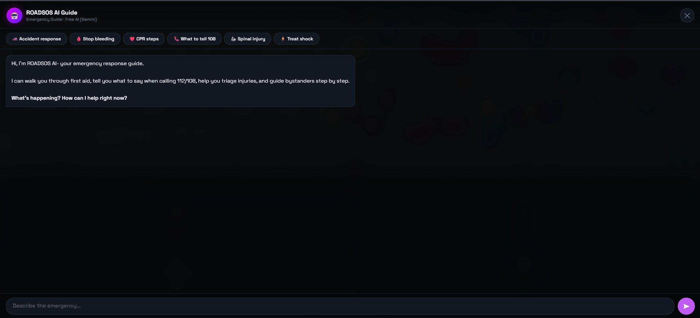
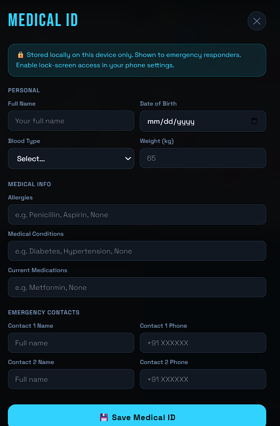
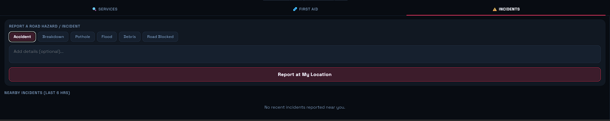
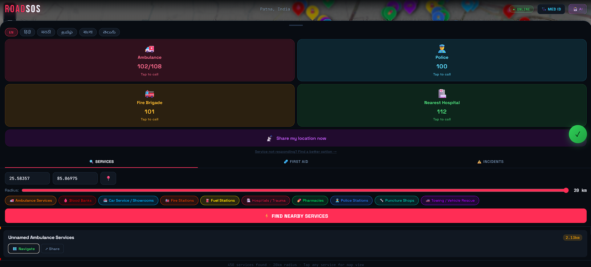

# 🚨 ROADSOS
### Road Accident Emergency Services Locator- Next Generation

> The **life-saving** upgrade: crash detection, Golden Hour timer, AI emergency guide, Medical ID, and real-time location broadcast all working offline.

## Screenshots

### Home Interface


### AI Emergency Guide


### Medical ID


### Incident Reporting


### Emergency Services Search


### Loading Screen


---

## Project Structure

```
roadsos_v3/
├── roadsos_core.py       ← Core engine: OSM, SQLite cache, haversine, first aid KB
├── cli.py                ← CLI with colour output + first aid guide
├── app.py                ← Flask server + REST API (10 endpoints)
├── templates/
│   └── index.html        ← Full-stack PWA frontend (mobile-first)
├── static/
│   ├── sw.js             ← Service worker (offline caching)
│   └── manifest.json     ← PWA manifest with shortcuts
├── screenshots/
│   ├── home.png
│   ├── ai-guide.png
│   ├── medical-id.png
│   ├── incidents.png
│   ├── services.png
│   └── loading.png
├── requirements.txt
├── .env.example
└── README.md

```

---

## Setup

### 1. Clone and install

```bash
git clone https://github.com/sciencebanda09/ROADSOS.git
cd ROADSOS
pip install -r requirements.txt
```

### 2. Configure your API key

```bash
# Copy the example env file
cp .env.example .env

# Edit .env and add your free Gemini key
# Get it at: https://aistudio.google.com/app/apikey  (no credit card needed)
```

Your `.env` file should look like:
```
GEMINI_API_KEY=your_actual_key_here
```

### 3. Run

```bash
python app.py

```

> **No key?** The app still works fully — the AI Guide falls back to a built-in offline keyword-response system covering all major emergency scenarios (bleeding, CPR, burns, fractures, choking, shock, spinal injury, etc.).

---

## Key Features

### Crash Auto-Detection
Uses the device's accelerometer (DeviceMotion API) to detect sudden impacts.
- Threshold: 20 m/s² delta acceleration
- 10-second countdown overlay before auto-SOS
- Cancel with one tap ("I'm Okay"), or confirm to trigger full SOS
- Re-arms after 30 seconds to prevent false re-triggers
- iOS 13+: requests permission on first user interaction

### ⏱ Golden Hour Timer
The "Golden Hour" is the critical 60 minutes after trauma when medical care is most effective.
- Animated circular ring countdown from 60:00
- Turns red + pulses in the last 10 minutes
- Auto-starts when SOS is triggered

### AI Emergency Guide (Gemini — Free)
In-app conversational AI for real emergencies:
- Powered by **Google Gemini 1.5 Flash** via `/api/ai` on the Flask server
- **Completely free** — 15 req/min, 1500 req/day, no credit card needed
- API key stays on the server (never exposed in browser)
- Step-by-step first aid guidance, injury triage, what to say to 108/112
- **Full offline fallback** — keyword-matched responses for 10 emergency types

### Medical ID
Critical medical information stored **locally** (localStorage, never sent to server):
- Blood type, DOB, weight
- Allergies (highlighted in red)
- Medical conditions and medications
- Two emergency contacts with tap-to-call

### Location Broadcast
One-tap location sharing in an emergency:
- Uses native Web Share API (Android/iOS share sheet)
- Falls back to WhatsApp deeplink with pre-filled message
- Message includes Google Maps coordinates

### First Aid Knowledge Base (Fully Offline)
8 injury types with step-by-step illustrated guides:
- Severe Bleeding, CPR, Fracture, Burns
- Head Injury, Choking, Shock, Spinal Injury

### Hold-to-SOS Button
Prevents accidental emergency activation:
- Must hold for 1.5 seconds (fills up with visual feedback)
- Reveals country-specific emergency call numbers
- Starts the Golden Hour timer

---

## REST API Endpoints

| Endpoint | Method | Description |
|---|---|---|
| `GET /api/search` | GET | Find nearby services (lat, lon, radius, categories) |
| `GET /api/emergency` | GET | Emergency numbers by country code |
| `GET /api/emergency/all` | GET | All 60+ countries emergency numbers |
| `GET /api/geocode` | GET | Reverse geocode coordinates |
| `GET /api/categories` | GET | All service categories |
| `GET /api/firstaid` | GET | First aid topic menu (offline-cached) |
| `GET /api/firstaid/<type>` | GET | Detailed steps for one injury |
| `GET /api/incidents` | GET | Nearby crowdsourced incidents |
| `POST /api/incidents` | POST | Report a road hazard |
| `GET /api/share` | GET | Generate shareable location links |
| `GET /api/health` | GET | Health check |

---

## Database Schema

### `services`
| Column | Type | Description |
|---|---|---|
| osm_id | TEXT | OpenStreetMap element ID |
| category | TEXT | hospital / police / ambulance / etc. |
| name | TEXT | Name of the service |
| lat / lon | REAL | GPS coordinates |
| phone | TEXT | Contact phone |
| address | TEXT | Street address |
| region_key | TEXT | Cache bucket (lat_lon_radius) |
| cached_at | TEXT | ISO timestamp |

### `emergency_numbers` (60+ countries)
| Column | Type |
|---|---|
| country_code | TEXT (PK) |
| police | TEXT |
| ambulance | TEXT |
| fire | TEXT |
| general | TEXT |

### `incidents` (crowdsourced)
| Column | Type | Description |
|---|---|---|
| lat / lon | REAL | Location |
| type | TEXT | accident / breakdown / pothole / flood / debris / blocked |
| description | TEXT | Optional details |
| reported_at | TEXT | ISO timestamp |
| active | INTEGER | 1 = active |

---

## Service Categories (10)

| # | Category | OSM Tags |
|---|---|---|
| 1 | Hospital / Trauma | amenity=hospital, healthcare=hospital |
| 2 | Ambulance | emergency=ambulance_station |
| 3 | Police | amenity=police |
| 4 | Blood Bank | amenity=blood_bank |
| 5 | Fire Station | amenity=fire_station |
| 6 | Towing | shop=car_repair |
| 7 | Puncture Shop | shop=tyres |
| 8 | Pharmacy | amenity=pharmacy |
| 9 | Fuel Station | amenity=fuel |
| 10 | Car Service | shop=car |

---

## 📡 Offline Functionality

1. **First run (online):** Fetches from OSM Overpass API (3 mirrors) → saves to SQLite
2. **Subsequent runs (within 24h):** Served from local SQLite — no network needed
3. **Full offline:** Uses cached data from previous sessions
4. **Service worker caches:** Home page, categories, first aid data, Leaflet map tiles
5. **Emergency numbers:** Always available offline (seeded at init)
6. **First Aid guide:** Fully offline, never needs network

---

## 💻 CLI Usage

```bash
# Basic search
python cli.py --lat 28.6139 --lon 77.2090

# Wider radius, verbose output
python cli.py --lat 19.0760 --lon 72.8777 --radius 10 --top 5 --verbose

# Specific categories only
python cli.py --lat 13.0827 --lon 80.2707 --categories hospital ambulance police

# Emergency numbers only
python cli.py --sos --country IN

# First aid guide menu
python cli.py --firstaid

# Specific first aid topic
python cli.py --firstaid cpr
python cli.py --firstaid bleeding
python cli.py --firstaid spinal

# List all 60+ countries
python cli.py --list-countries
```

---

## Dependencies

- `flask` — web server
- `requests` — OSM Overpass + Nominatim API calls
- `python-dotenv` — environment variable loading
- `sqlite3` — built-in Python
- `leaflet.js` — map (CDN)
- `Google Gemini 1.5 Flash API` — AI emergency guide (free tier, optional)

---