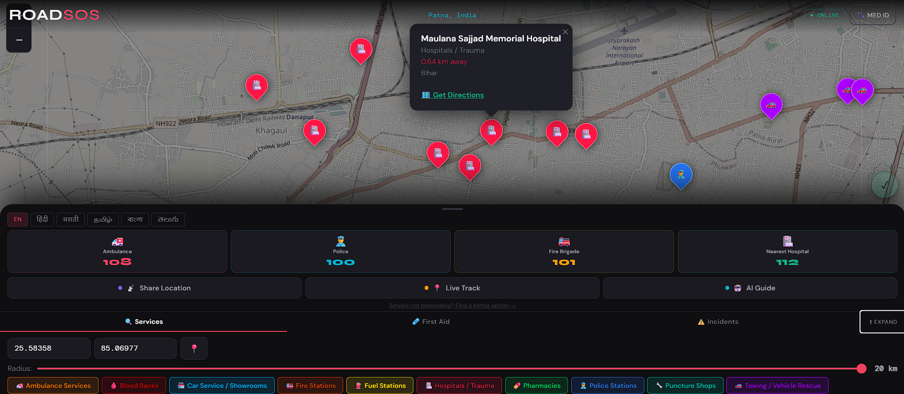

# ROADSOS
### Road Accident Emergency Services Locator

Real-time emergency services locator, crash detection, AI emergency guide, and live location broadcast — built as an offline-capable PWA for road accident response in India and 60+ countries.

**Live demo:** https://roadsos-8ld0.onrender.com

---

## Screenshots

| Home | Services | AI Guide |
|------|----------|----------|
|  |  |  |

| Medical ID | Incidents | Loading |
|------------|-----------|---------|
|  |  |  |

---

## Project Structure

```
roadsos/
├── roadsos_core.py       — Core engine: OSM queries, SQLite cache, haversine, first aid data
├── app.py                — Flask server with 12 REST endpoints
├── cli.py                — Colour terminal CLI
├── templates/
│   └── index.html        — Mobile-first PWA frontend (single file)
├── static/
│   ├── sw.js             — Service worker for offline caching
│   └── manifest.json     — PWA manifest with home screen shortcuts
├── requirements.txt
└── README.md
```

---

## Setup

### 1. Clone and install dependencies

```bash
git clone https://github.com/sciencebanda09/ROADSOS.git
cd ROADSOS
pip install -r requirements.txt
```

### 2. Configure API keys

```bash
cp .env.example .env
```

Edit `.env`:

```env
# Primary AI backend (Claude — recommended)
ANTHROPIC_API_KEY=your_key_here

# Fallback AI backend (Gemini — optional, free tier available)
GEMINI_API_KEY=your_key_here
```

Get an Anthropic key at https://console.anthropic.com — the Haiku model used here is the fastest and cheapest option. Get a free Gemini key (no credit card) at https://aistudio.google.com/app/apikey.

The app works fully without either key — the AI guide falls back to a built-in offline keyword system covering all major emergency scenarios.

### 3. Run

```bash
python app.py
```

---

## Features

### Crash Auto-Detection
Monitors the device accelerometer via the DeviceMotion API and detects sudden impacts above a 20 m/s² threshold. Triggers a 10-second countdown overlay before auto-SOS. One tap cancels ("I'm Okay"), or confirm to trigger the full SOS flow. Re-arms after 30 seconds. iOS 13+ requires permission on first interaction.

### Golden Hour Timer
Animated 60-minute countdown that starts automatically when SOS is triggered. Turns red and pulses in the final 10 minutes. Based on the clinical concept that trauma outcomes are significantly better when definitive care is reached within the first hour.

### AI Emergency Guide
Conversational in-app assistant for real emergencies. Uses Claude (Haiku) via the Anthropic API by default, with Gemini 1.5 Flash as fallback. The API key stays server-side and is never exposed to the browser. Covers first aid, CPR, triage, injury classification, and what to communicate to 108 or 112. Falls back fully offline to keyword-matched responses for 10 emergency types when no network or key is available.

### Medical ID
Critical medical data stored entirely in localStorage — never sent to the server. Includes blood type, date of birth, weight, allergies (shown prominently in red), medical conditions, current medications, and two emergency contacts with tap-to-call.

### Location Broadcast
Generates a shareable live-tracking link via the `/api/track` endpoint. The link shows a live map that auto-refreshes every 20 seconds and expires 2 hours after creation. Also generates pre-filled WhatsApp and SMS emergency messages with Google Maps coordinates.

### First Aid Knowledge Base
Eight injury types with step-by-step illustrated guides, fully available offline: Severe Bleeding, CPR, Fracture, Burns, Head Injury, Choking, Shock, Spinal Injury.

### Hold-to-SOS Button
Requires a 1.5-second hold to prevent accidental activation. Reveals country-specific emergency numbers on trigger and starts the Golden Hour timer.

### Nearby Services Search
Queries OpenStreetMap via the Overpass API across 10 categories. Results are cached in SQLite for 24 hours — subsequent searches for the same area are instant and work offline. All 10 categories are fetched in parallel, so a full live search completes in roughly the time of a single OSM request rather than ten.

---

## REST API

| Method | Endpoint | Description |
|--------|----------|-------------|
| GET | `/api/search` | Nearby services (`lat`, `lon`, `radius`, `categories`) |
| GET | `/api/emergency` | Emergency numbers by country code |
| GET | `/api/emergency/all` | All 60+ countries |
| GET | `/api/geocode` | Reverse geocode coordinates |
| GET | `/api/categories` | All service categories with metadata |
| GET | `/api/firstaid` | First aid topic index |
| GET | `/api/firstaid/<type>` | Step-by-step guide for one injury type |
| GET | `/api/incidents` | Crowdsourced incidents near a location |
| POST | `/api/incidents` | Report a road hazard |
| GET | `/api/share` | Shareable location links |
| POST | `/api/track` | Start a live tracking session |
| GET | `/api/track/<token>` | Get current position for a token |
| PUT | `/api/track/<token>` | Update position |
| DELETE | `/api/track/<token>` | End tracking session |
| GET | `/track/<token>` | Live tracking map page |
| POST | `/api/ai` | AI emergency guide (Claude / Gemini) |
| GET | `/api/health` | Health check |

---

## Database Schema

### `services`

| Column | Type | Description |
|--------|------|-------------|
| osm_id | TEXT | OpenStreetMap element ID |
| category | TEXT | hospital / police / ambulance / etc. |
| name | TEXT | Facility name |
| lat / lon | REAL | GPS coordinates |
| phone | TEXT | Contact number |
| address | TEXT | Street address |
| region_key | TEXT | Cache bucket key |
| cached_at | TEXT | ISO timestamp |

### `emergency_numbers`

| Column | Type |
|--------|------|
| country_code | TEXT (PK) |
| country_name | TEXT |
| police | TEXT |
| ambulance | TEXT |
| fire | TEXT |
| general | TEXT |

### `incidents`

| Column | Type | Description |
|--------|------|-------------|
| lat / lon | REAL | Location |
| type | TEXT | accident / breakdown / pothole / flood / debris / blocked |
| description | TEXT | Optional detail |
| reported_at | TEXT | ISO timestamp |
| active | INTEGER | 1 = active |

### `live_tracks`

| Column | Type | Description |
|--------|------|-------------|
| token | TEXT (PK) | Secure random URL token |
| lat / lon | REAL | Current position |
| created_at | TEXT | ISO timestamp |
| updated_at | TEXT | Last position update |
| active | INTEGER | 0 = expired |

---

## Service Categories

| # | Category | OSM Tags |
|---|----------|----------|
| 1 | Hospital / Trauma | amenity=hospital, healthcare=hospital |
| 2 | Ambulance | emergency=ambulance_station |
| 3 | Police | amenity=police |
| 4 | Blood Bank | amenity=blood_bank |
| 5 | Fire Station | amenity=fire_station |
| 6 | Towing | shop=car_repair |
| 7 | Puncture Shop | shop=tyres |
| 8 | Pharmacy | amenity=pharmacy |
| 9 | Fuel Station | amenity=fuel |
| 10 | Car Service | shop=car |

---

## Offline Behaviour

On first run (online): fetches data from the OSM Overpass API and writes it to SQLite. On subsequent requests within 24 hours, the cache is served directly with no network required. If the network is unavailable, the last cached data is returned. The service worker additionally caches the home page, category list, first aid data, and Leaflet tile layers. Emergency numbers and the first aid guide are always available offline.

---

## CLI

```bash
# Search near a location
python cli.py --lat 28.6139 --lon 77.2090

# Wider radius, verbose output
python cli.py --lat 19.0760 --lon 72.8777 --radius 10 --top 5 --verbose

# Filter categories
python cli.py --lat 13.0827 --lon 80.2707 --categories hospital ambulance police

# Emergency numbers only
python cli.py --sos --country IN

# First aid guide (interactive menu)
python cli.py --firstaid

# Specific first aid topic
python cli.py --firstaid cpr
python cli.py --firstaid bleeding

# List all 60+ countries
python cli.py --list-countries
```

---

## Dependencies

- `flask` — web server
- `requests` — HTTP client for OSM Overpass and Nominatim
- `python-dotenv` — environment variable loading
- `flask-limiter` — rate limiting on incident reports
- `bleach` — HTML sanitisation
- `sqlite3` — built-in Python, no external database needed
- `leaflet.js` (CDN) — interactive maps
- Anthropic Claude API or Google Gemini API — AI emergency guide (optional, both free tiers available)